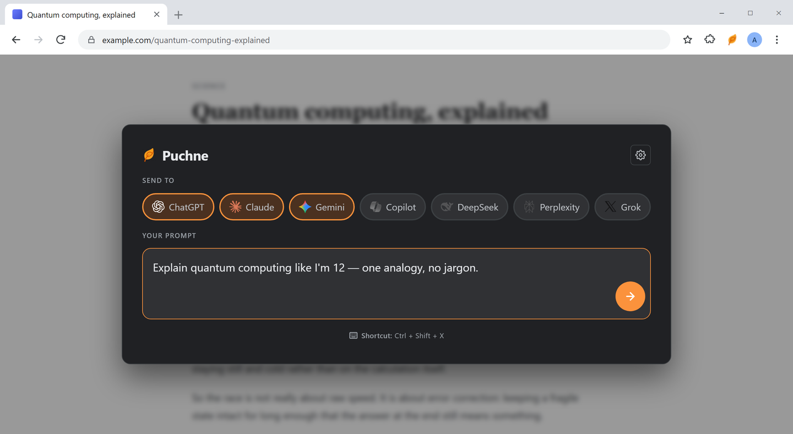
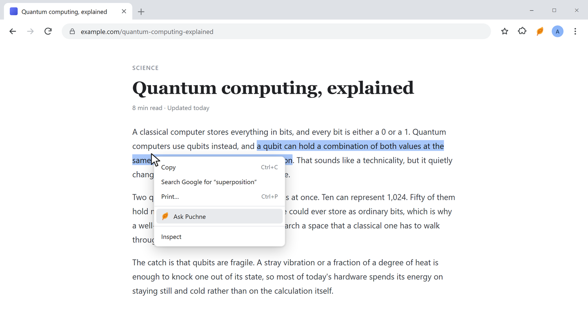
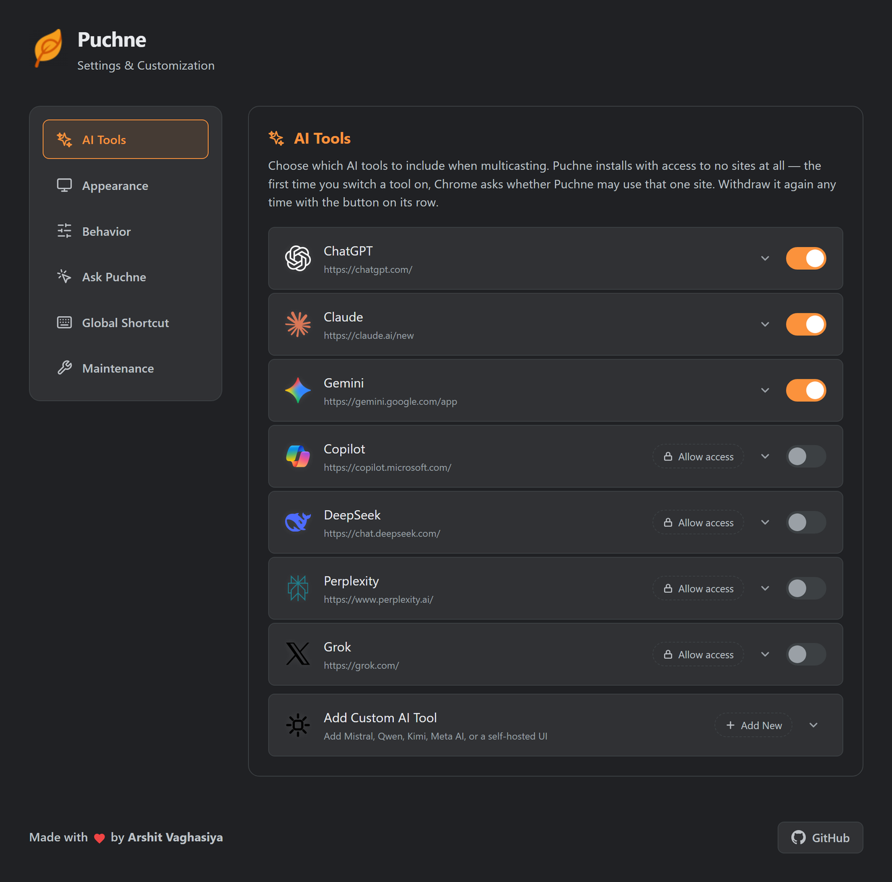
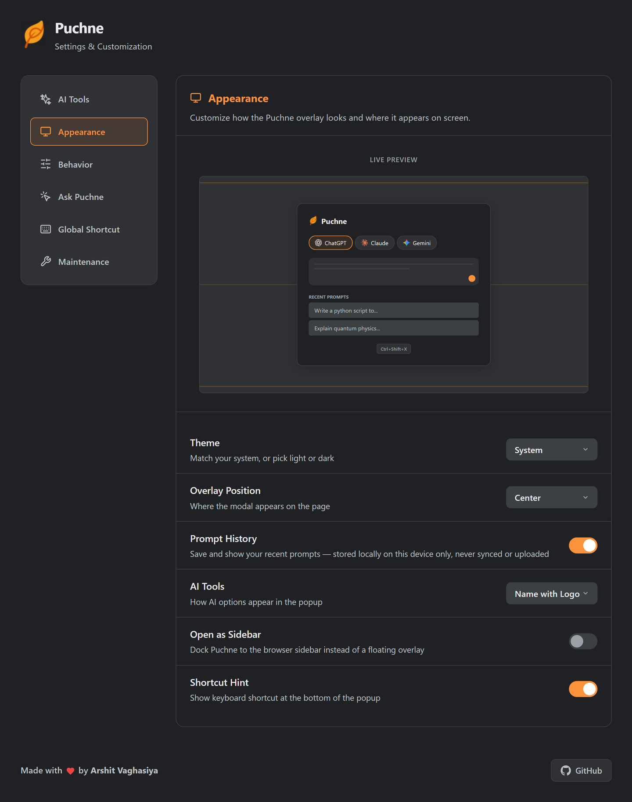
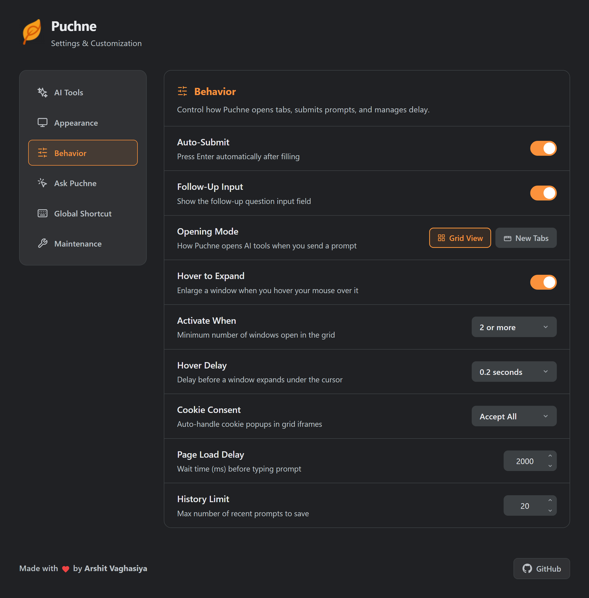
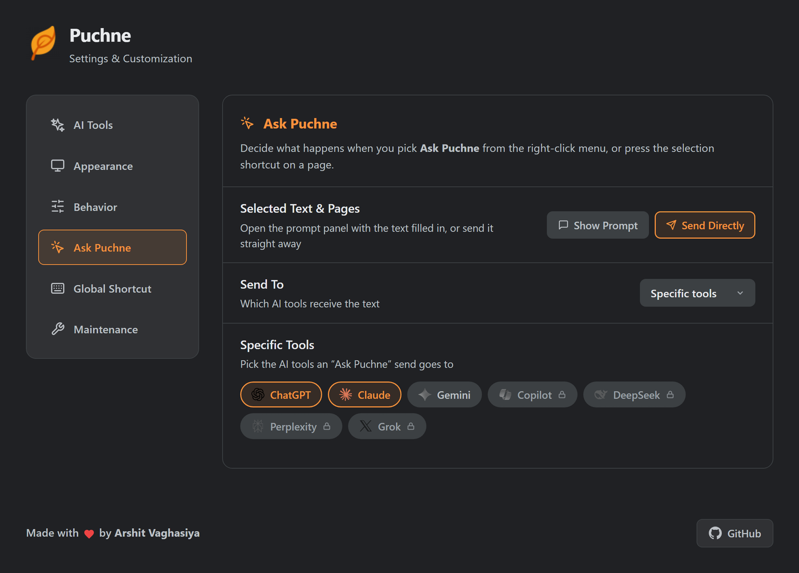

<p align="center">
  
</p>

<h1 align="center">Puchne</h1>

<p align="center"><b>One prompt. Every AI. At once.</b></p>

Ask once and Puchne sends your prompt to **ChatGPT, Claude, Gemini, Copilot, DeepSeek, Perplexity and Grok** at the same time — so you compare answers instead of copy-pasting across tabs.

*Puchne comes from the Gujarati **પૂછવું** (Puchhvu) — "to ask".*

<p align="center">
  
</p>

---

## Features

- **Multicast prompting** — one box, every AI tool you've switched on.
- **Grid view** — all the answers side by side in a single tab. Hover to enlarge a cell, re-open a closed one, or reset the layout.
- **New tabs mode** — prefer real tabs? Puchne opens them and files them into one Chrome tab group.
- **Follow-up bar** — keep going without retyping: one input sends your next question to every AI that's already open.
- **Ask from any page** — select text and hit `Ctrl+Shift+S` (or right-click → *Ask Puchne*). Review the prompt first, or fire it off directly — to all your tools or just the ones you pick.
- **Open anywhere** — `Ctrl+Shift+X` pops Puchne up on any page as a floating overlay, or dock it as a browser sidebar.
- **Add your own tools** — Mistral, Qwen, Kimi, a self-hosted UI: give it a URL and an input selector, then test it in one click.
- **Auto-submit or pre-fill** — let Puchne press Enter for you, or leave the prompt in the box to edit first.
- **Handles the friction** — dismisses cookie banners in grid frames and waits for slow pages before typing.
- **Recent prompts** — reuse anything you've asked before, kept on your device only.
- **Made to live in** — system / light / dark theme, full keyboard access, and it respects reduced motion.

## Ask from any page

Select some text anywhere, right-click, and **Ask Puchne** is sitting in the menu — same as `Ctrl+Shift+S`. It either opens the prompt panel with the selection filled in, or sends it straight to your tools; you choose which in Settings.



## Settings

Everything is on one page — right-click the Puchne icon and pick **Options**. Changes save as you make them.

**AI Tools** — switch tools on and off, grant or withdraw a site, override the CSS selectors Puchne types into, or add a tool that isn't on the list.



**Appearance** — theme, where the overlay sits on the page, whether it docks as a sidebar, how tools are labelled, and whether recent prompts are kept. The live preview updates as you change them.



**Behavior** — grid view or new tabs, auto-submit, the follow-up bar, hover-to-expand and its delay, cookie handling, and how long to wait before typing.



**Ask Puchne** — whether the right-click menu and `Ctrl+Shift+S` show the prompt first or send it straight away, and which tools that send reaches.



## Privacy

Puchne installs with access to **no websites at all**. The first time you turn a tool on, Chrome asks for that one site — and you can withdraw it from Settings whenever you like. No account, no server, no tracking: your prompts go straight from your browser to the AI sites you chose.

## Install

```bash
git clone https://github.com/arshit09/puchne.git
```

1. Open `chrome://extensions/` and turn on **Developer mode**.
2. Click **Load unpacked** and select the cloned folder.
3. Optional — change the shortcut keys at `chrome://extensions/shortcuts`.

## License

MIT — see [LICENSE](LICENSE). Contributions welcome: bug reports, selector fixes, UI polish.
